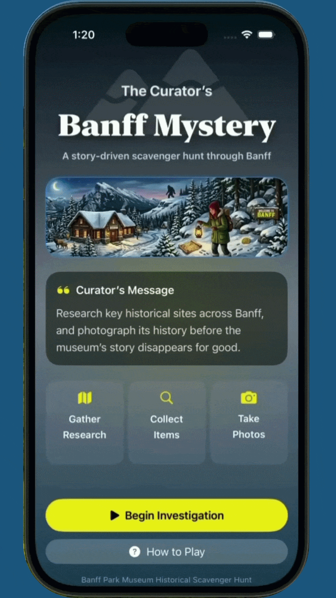

# Discover Banff: Legends and Lore

An atmospheric SwiftUI adventure game set in Banff, Alberta, where players explore historic locations, collect clues, photograph landmarks, solve puzzles, and uncover the mystery of Bigfoot and the Lost Lemon Mine.



## Overview

**Discover Banff: Legends and Lore** is an interactive story-driven iOS game built with **SwiftUI**. Players begin outside the Banff Park Museum and gradually unlock new locations across Banff by collecting items, reading notes, solving environmental puzzles, and completing a historical photo journal.

The game blends:

- point-and-click exploration
- inventory-based puzzles
- historical photo collection
- location travel through a museum corkboard
- atmospheric ambience and sound effects
- a final curator puzzle
- a folklore-inspired ending involving Bigfoot and the Lost Lemon Mine

The experience is designed to feel like a cozy mystery, part travel adventure, part local legend, and part escape room.

---

## Story

The Banff Park Museum is in trouble.

Public interest is fading, the curator is desperate, and only one mystery might save it:

> **Who guards the Lost Lemon Mine?**

Armed with a camera, a journal, and a growing bag of unusual tools, players travel across Banff to gather proof, follow historical leads, and piece together a legend no one was supposed to find.

But deep beneath Tunnel Mountain, the story becomes stranger than expected.

Was it a dream?

Or did something follow you back?

---

## Features

### Exploration-Based Gameplay

Players interact with illustrated scenes using tappable hotspots. Each location includes objects to inspect, collect, unlock, or photograph.

Locations include:

- Banff Park Museum Exterior
- Banff Park Museum Interior
- Bow Falls
- Cave and Basin
- Banff Springs Hotel
- Downtown Banff
- Upper Hot Springs
- Sulphur Mountain
- Sulphur Mountain Observatory
- Lake Minnewanka
- Tunnel Mountain
- Bigfoot’s Lair

---

### Inventory System

Players collect useful items and use them to unlock new areas or solve puzzles.

Example inventory items include:

- Small Shovel
- Gaff Hook
- Wooden Matches
- Vintage Brass Token
- Observatory Locker Key
- Rusty Crowbar
- Woodcutter’s Axe
- Lost Lemon Gold Nugget

Inventory items are tracked through a central `GameState` object and displayed in the player’s bag.

---

### Historical Photo Journal

Players use an in-game camera to photograph important locations and moments. Each photo contributes to the journal and reveals a secret letter for the final puzzle.

The photo journal encourages players to fully explore Banff before returning to the curator.

---

### Corkboard Travel System

The museum corkboard acts as a travel hub. As the player discovers leads and collects important items, new Banff locations become available.

Some locations unlock immediately, while others require specific tools or story progression.

---

### Environmental Puzzles

The game includes a variety of simple adventure-game puzzle interactions, such as:

- opening locked containers
- melting frozen doors
- breaking boarded cave entrances
- using collected tools
- solving a museum door combination lock
- triggering story events through exploration

---

### Bigfoot Lair Sequence

After entering Tunnel Mountain, players experience a more cinematic sequence involving:

- a blackout
- waking up in Bigfoot’s lair
- discovering the Lost Lemon Mine
- meeting the Bigfoot family
- escaping back to the museum exterior

The return to the museum includes an eyes-opening effect, a dreamlike story prompt, and a gold nugget reveal.

---

### Final Curator Puzzle

Once all required photos are collected, the curator asks the final question:

> **Who guards the Lost Lemon Mine?**

Players arrange discovered letter scraps to form the answer. The puzzle uses tappable image scraps rather than a keyboard text field for a more tactile storybook feel.

---

### Sound and Ambience

The game includes:

- looping ambience by location
- tap/click feedback
- item collection sounds
- camera sounds
- puzzle feedback
- magical location travel sounds
- special reveal sounds

Ambience is managed through a reusable `SoundManager` using `AVAudioPlayer`.

---

## Built With

- **Swift**
- **SwiftUI**
- **AVFoundation**
- **Combine**
- **Xcode**
- **iOS**

---

## Project Structure

```text
iOSApp2/
├── App/
│   └── iOSApp2App.swift
│
├── State/
│   └── GameState.swift
│
├── Models/
│   ├── InventoryItem.swift
│   ├── Location.swift
│   ├── LocationLead.swift
│   ├── Photo.swift
│   ├── SceneHotspot.swift
│   └── SceneOverlayObject.swift
│
├── Managers/
│   ├── SoundManager.swift
│   └── HapticsManager.swift
│
├── Sound/
│   ├── GameSound.swift
│   └── AmbientSound.swift
│
├── Views/
│   ├── MuseumExteriorView.swift
│   ├── MuseumInteriorView.swift
│   ├── BowFallsView.swift
│   ├── CaveAndBasinView.swift
│   ├── BanffSpringsHotelView.swift
│   ├── DowntownBanffView.swift
│   ├── HotSpringsView.swift
│   ├── SulphurMountainView.swift
│   ├── ObservatoryInteriorView.swift
│   ├── LakeMinnewankaView.swift
│   ├── TunnelMountainView.swift
│   ├── BigfootLairView.swift
│   └── CuratorEndingView.swift
│
├── Components/
│   ├── ImageSceneView.swift
│   ├── HotspotZoomOverlay.swift
│   ├── InventoryView.swift
│   ├── JournalView.swift
│   ├── FakeCameraView.swift
│   ├── ItemCollectedOverlay.swift
│   ├── PocketGoldNuggetOverlay.swift
│   ├── LetterScrapPuzzleView.swift
│   ├── CombinationLockView.swift
│   ├── SnowfallOverlay.swift
│   └── TopHUDView.swift
│
└── Assets/
    ├── Images
    ├── Item Icons
    ├── Letter Scraps
    └── Audio
```

---

## Getting Started

**Requirements**

- macOS
- Xcode
- iOS Simulator or physical iPhone
- SwiftUI-compatible iOS target

Recommended:

- Xcode 15 or newer
- iOS 17 or newer

**Installation**

Clone the repository:

```text
git clone https://github.com/vibrant-impact/iOSApp2
```
Open the project in Xcode:

```text
open iOSApp2.xcodeproj
```
Then:

1. Select an iPhone simulator or connected device.
2. Build and run with Command + R.
3. Start exploring Banff.

---

## Development Notes

This project was built as a highly visual SwiftUI adventure game. Many scenes rely on custom image assets and tappable coordinate-based hotspots.

The hotspot system uses a base canvas size for each scene, allowing hotspot rectangles to scale with the displayed image.

Example:

```text
private let canvasSize = CGSize(width: 1290, height: 2796)

private let hotspots: [SceneHotspot] = [
    SceneHotspot(
        id: "mailbox",
        name: "Mailbox",
        rect: CGRect(x: 13, y: 1871, width: 354, height: 245)
    )
]
```

---

## Future Improvements

Possible future additions:

save/load persistence
accessibility improvements
larger map interface
hint system
animated scene transitions
more historical facts in the journal
achievements
iPad layout polish
localization
App Store trailer and screenshots

---

## Credits

Created by Stephanie Otteson.

Built with SwiftUI, late-night debugging, Banff inspiration, and one very suspicious Bigfoot.
